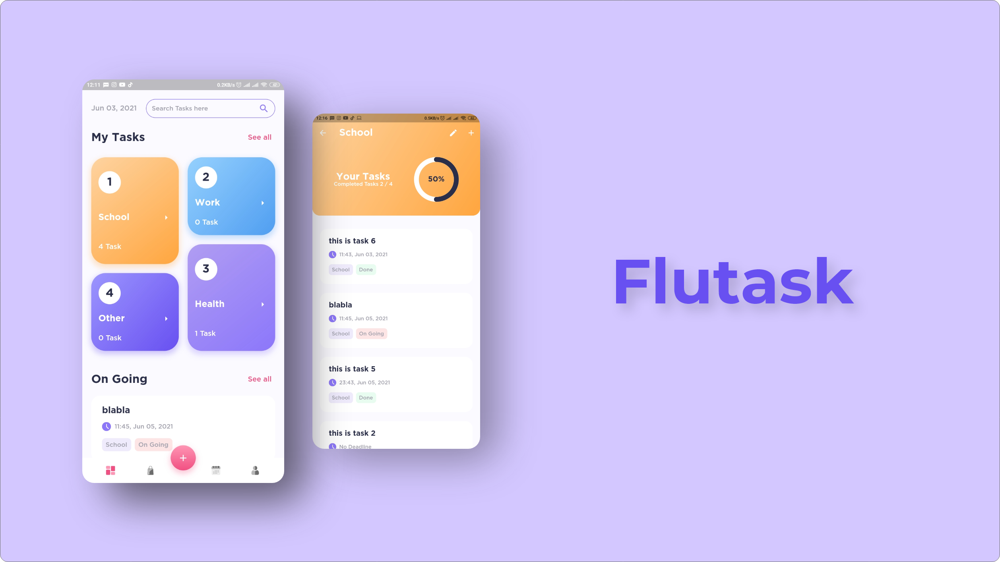

<h1 align="center">
  Flutask
</h1>
<p align="center">
  Task Management App
</p>
<p align="center">
  <a href="https://flutter.dev/"></a>
  <a href="https://dart.dev/"></a>
  <a href="https://github.com/Adithya-13/Flutask/"></a>
</p>

<p align="center">
  
</p>

## Table of Contents
- [Introduction](#introduction)
- [Installation](#installation)
- [Demo](#demo)
- [Features](#features)
- [Tech Stack](#tech-stack)
- [Dependencies](#dependencies)
- [Screen](#screen)
- [Util Tasks](#util-tasks)
- [Future Feature](#future-feature)
- [Feedback from user](#feedback-from-user)

## Introduction

This project contains about task Management with CRUD such as Add Task, Update Task, Calendar Task, and other. You can see the [Demo](#demo) from this app, and so many things i haven't add other feature like Notification, Save to PDF / Excel, Backup Database to Cloud, and other. You can see right here at [Future Feature](#future-feature)

For the 3rd Party Library i used in this project, you can look [here](#dependencies), and for the Tech Stack, i used the BloC Pattern, State Management with BloC, and so many things that you can see at [here](#tech-stack).

I Use the [Moor Database](https://moor.simonbinder.eu/docs/) for database local. if you want to learn it, you can go to they website right here at [moor.simonbinder.eu](https://moor.simonbinder.eu/docs/getting-started/)

I Hope this Project will help someone, if you feel helped with this project, you can give stars to support me, thank you very much :)

## Installation

Clone or Download and Open it into Android Studio, VSCode, or Other IDE / Text Editor
```
    https://github.com/Adithya-13/Flutask.git
```  

## Demo

|Getting Started|Add Task|Update Task|Delete Task|
|--|--|--|--|
|||||

|Search Task|Detail Category|Calendar Task|
|--|--|--|
||||

## Features
- On Going Tasks
- Complete Tasks
- Detail Category Tasks
- Search Tasks
- Calendar Tasks
- Add Tasks
- Update Tasks
- Delete Tasks
- set Deadline Tasks
- And more Soon

## Tech Stack
- BloC Architecture Pattern
- BloC State Management
- Moor Local Database
- Clean Architecture (data, domain, presentation)
- Custom Widget (Calendar and Time Picker)

## Dependencies
- [Equatable](https://pub.dev/packages/equatable)
- [RxDart](https://pub.dev/packages/rxdart)
- [Flutter Bloc](https://pub.dev/packages/flutter_bloc)
- [Logging](https://pub.dev/packages/logging)
- [Flutter SVG](https://pub.dev/packages/flutter_svg)
- [Lottie](https://pub.dev/packages/lottie)
- [Intl](https://pub.dev/packages/intl)
- [Auto Size Text](https://pub.dev/packages/auto_size_text)
- [Carousel Slider](https://pub.dev/packages/carousel_slider)
- [Flutter Staggered Grid View](https://pub.dev/packages/flutter_staggered_grid_view)
- [Moor Flutter](https://pub.dev/packages/moor_flutter)
- [Modal Bottom Sheet](https://pub.dev/packages/modal_bottom_sheet)
- [Get Storage](https://pub.dev/packages/get_storage)
- [Flutter Color](https://pub.dev/packages/flutter_color)
- [Percent Indicator](https://pub.dev/packages/percent_indicator)
- [Scrollable Positioned List](https://pub.dev/packages/scrollable_positioned_list)
- [Auto Animated](https://pub.dev/packages/auto_animated)
- [Day Night Time Picker](https://pub.dev/packages/day_night_time_picker)
- [Calendar_Timeline (custom)](https://pub.dev/packages/calendar_timeline)

<details>
  <summary><b>TODO!</b></summary>
  <br>
  
  ## Screen
  - [x] Splash Page
  - [x] OnBoard Page
  - [x] Dashboard Page
  - [ ] Bag Page
  - [x] Calendar Page
  - [ ] Profile Page
  - [x] Add Task BottomSheet
  - [x] Detail Task
  - [x] Detail Category
  - [x] Search Page

  ## Util Tasks
  - [x] Focus Node unfocused
  - [x] dropdown null value
  - [x] completed attribute
  - [x] task with category list
  - [x] category with total tasks
  - [x] done tasks
  - [x] fix padding in bottom nav bar item
  - [x] cleaning up dao
  - [x] error border
  - [x] update & delete tasks
  - [x] create snackBar
  - [x] date & time picker cupertino
  - [x] change time picker [with this lib](https://pub.dev/packages/day_night_time_picker)
  - [ ] add category task
  - [ ] search in category
  - [ ] edit category
  - [ ] change description of onboard
  - [x] total task of on going or complete

  ## Future Feature
  - [ ] save to excel
  - [ ] notification
  - [ ] statistics
  - [ ] event organizer
  - [x] calendar
  - [ ] multi-language
  - [ ] setting
  - [ ] attachment
  - [x] search tasks
  - [ ] [showcase](https://pub.dev/packages/showcaseview)
  - [ ] Backup to Cloud
  - [ ] Sign in & Sign up

  ## Feedback from user
  - [x] scrollable list at the end of item will scroll overflow
  - [x] number in time picker is missing, use all number instead. (change style of time picker) 
  - [ ] scroll calendar animation no smooth
  - [x] description make optional
  - [x] initial category task (work, health)
  - [x] in the calendar, if the day is sunday, set different color (pink)
  - [x] list animation in search
  - [ ] category task remove see all
  - [x] update task -> mark as done, check icon save edit
  - [x] delete task add dialog before really deleted
  
</details>
